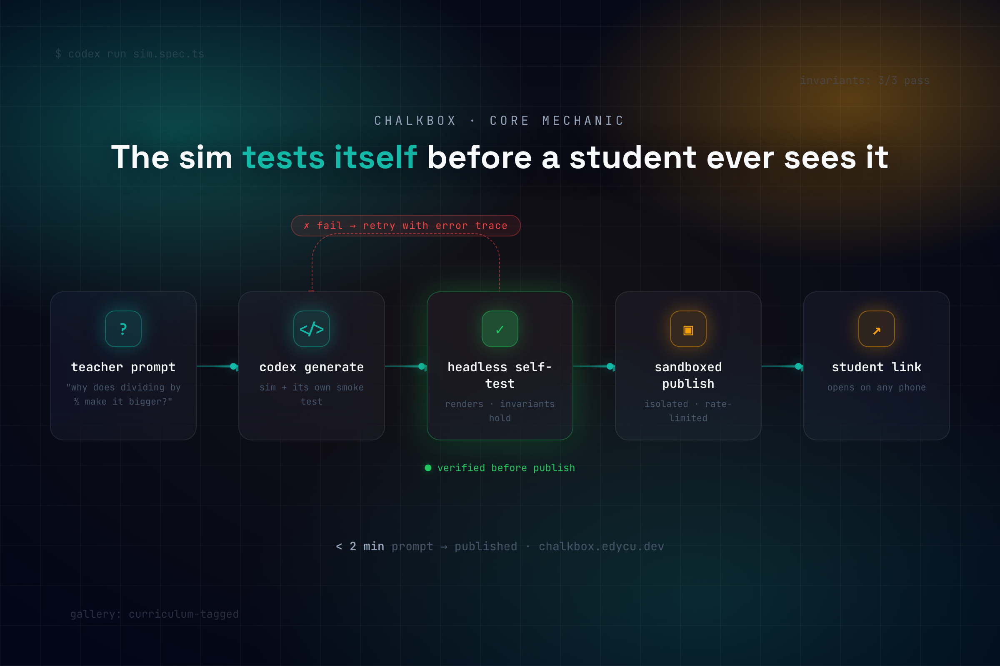

<div align="center">
  

  <h1>Chalkbox 🖍️</h1>
  <p><em>Type the misconception; get a self-tested interactive manipulative in two minutes.</em></p>

  

  <br/><br/>

  [](https://chalkbox.edycu.dev)
  [](#-demo-video)
  [](https://openai.devpost.com)

  <br/>

  
  
  
  
  
  
  [](LICENSE)
  [](https://github.com/edycutjong/chalkbox/actions/workflows/ci.yml)
  [](https://github.com/edycutjong/chalkbox/actions/workflows/codeql.yml)

</div>

---

## 📸 See it in Action

<div align="center">
  <a href="https://chalkbox.edycu.dev">
  </a>
  
</div>

> **A teacher types a misconception → Codex writes a manipulative, runs its own smoke test, retries on failure, and only then publishes → a student opens it on any phone.** Nothing untested reaches a child.

---

## 💡 The Problem & Solution

Interactive manipulatives are the single most effective tool for breaking a math or physics misconception — and the one artifact a teacher can never make herself. She can write a worksheet. She can find a video. She cannot author software at 9 PM for tomorrow's 8 AM class. Edtech vendors ship a fixed catalog on a multi-month roadmap, not the bespoke thing *her* class is stuck on tonight.

**Chalkbox** closes that gap. A teacher types the misconception she wants to break — *"show why dividing by a fraction makes the answer bigger, not smaller"* — and in under two minutes she has a live, draggable manipulative her students open on any phone. No code. No app store. No waiting for a vendor.

**Key Features:**
- ⚡ **Self-testing generation loop** — At runtime, Codex writes a single-file interactive React component, renders it headlessly, asserts its *interactive invariants* hold (a smoke test Codex also writes), retries with the error trace on failure, and only then publishes. This loop is the moat.
- 🎓 **Curriculum-tagged gallery** — A public grid seeded with manipulatives, each showing its real Common Core / NGSS standard code and the exact prompt that generated it.
- 📱 **Phone-friendly share links** — Students open a zero-chrome, phone-first sim. Generated components are static-validated (no network imports) and served under a strict no-network CSP; the cross-origin sandboxed-iframe host is the next hardening step.

---

## 🧠 Why the loop matters (the moat)

A single chat completion can produce plausible-looking code. It cannot **execute** it, **test** it, **read the failure**, and **fix** it. Chalkbox does exactly that, every generation:

```
G1  Luna safety + standard gate  →  accept (math, grade 6-8, CCSS.6.NS.A.1)
    codex generate               →  interactive component + invariant spec
G2  static/AST validation        →  import allowlist, no network APIs
    headless render              →  mounts, deterministic, fake timers
G3  interactive invariants       →  "drag divisor smaller ⇒ quotient bigger" ✓
    (fail → retry with trace, bounded budget)
G4  Luna output safety           →  no inappropriate labels
    publish                      →  strict no-network CSP (sandboxed-iframe host in progress)
```

The pedagogy itself is encoded as a machine-checked test. If Codex generates a sim where dragging the divisor down makes the quotient go *down*, it's pedagogically wrong even though it "renders fine" — and **G3 catches it and forces a retry.** See [`docs/COMPLEXITY.md`](docs/COMPLEXITY.md) for the full invariant DSL and sandbox model.

---

## 🏗️ Architecture & Tech Stack

| Layer | Technology |
|---|---|
| **Frontend** | Next.js + React on Vercel |
| **Generation engine** | GPT-5.6 (Sol) via the OpenAI Responses API — generates + retries in an isolated per-request VM/tmp workspace |
| **Models** | GPT-5.6 **Sol** (generation/iteration) · GPT-5.6 **Luna** (triage: safety gate + grade tag + standard alignment) |
| **Data** | Supabase (share links + gallery) |
| **Sandbox** | Null-origin iframe · strict CSP (`connect-src 'none'`) · import allowlist · AST validation |

Full design in [`docs/ARCHITECTURE.md`](docs/ARCHITECTURE.md) · complexity blueprint in [`docs/COMPLEXITY.md`](docs/COMPLEXITY.md) · demo data in [`docs/SEED_DATA.md`](docs/SEED_DATA.md).

---

## 🤝 Where Codex Accelerated

> Built in a single primary Codex CLI session — **`/feedback` Thread ID: `019f79dc-8393-7003-b79f-0e8075dfb4dd`** (submitted with this project). GPT‑5.6 **Sol** authored the runtime generation engine end-to-end; GPT‑5.6 **Luna** runs the cheap safety triage.

The product's moat — the runtime write → self-test → retry → publish loop — was authored by Codex in one session:

- **`RealOrchestrator` (`src/lib/harness/orchestrator.ts`)** — Codex wrote the full generation loop behind the existing `GenerationOrchestrator` interface, leaving the demo `StubOrchestrator` untouched so the keyless demo path still works.
- **Coupled component + probe (`src/lib/harness/generated-sim.ts`)** — the key design call: Sol must emit *both* a restricted React component *and* an executable `SimProbe`. The server renders the component headlessly, verifies every probe test-id actually appears in the rendered markup, then drives the **real** G3 invariant runner against it — so a generated sim can't fake its own test.
- **Server-only SSE route (`src/app/api/generate/route.ts`)** — all key-bearing generation moved server-side and each attempt streamed to the client, so the OpenAI key never reaches the browser.
- **Budget + safety** — `checkBudget()` gates every Sol round (attempts / tokens / wall-clock ceiling); `gpt‑5.6‑luna` runs the G1/G4 safety pass. Validation, render, invariant, and safety failures are fed back to Sol as retry traces.
- **`scripts/bench.ts`** — a reproducible p50/p95 latency + success-rate harness (`npm run bench -- N`).

Live generation activates only with `OPENAI_API_KEY` present **and** `CHALKBOX_DEMO_MODE=false`; a missing key or an API error falls back cleanly to the stub.

---

## 🚀 Getting Started

> **For Judges:** the seeded gallery at [chalkbox.edycu.dev](https://chalkbox.edycu.dev) is browsable with zero setup — no login.
>
> **Current status — runnable skeleton in demo mode.** The Create flow replays the flagship fraction-division build end-to-end (prompt → self-test → published share link) with no API keys. The harness it exercises is **real and unit-tested**: the static validator (import allowlist / no-network) and the interactive-invariant runner both work and pass. The live Codex-driven generation engine (arbitrary prompt → new verified sim) is the next milestone and drops in behind the `// STUB:` seams in `src/lib/harness/orchestrator.ts`.

### Prerequisites
- Node.js ≥ 20
- npm

### Local run
```bash
git clone https://github.com/edycutjong/chalkbox.git
cd chalkbox
npm install
cp .env.example .env.local  # add your OpenAI + Supabase keys
npm run dev
```

---

## 🧪 Testing & CI

The generation loop is the moat — so the harness that guards it is production-grade. A **6-stage GitHub Actions pipeline** runs on every push: **Quality → Security → Build → E2E → Performance → Deploy Gate**, with concurrency cancellation and a Node `20 / 22 / 24` matrix on `main`.

```bash
# ── Code Quality ────────────────────────────
npm run lint           # ESLint (next lint)
npm run typecheck      # TypeScript strict (tsc --noEmit)
npm run test           # Unit tests (Vitest)
npm run test:coverage  # Coverage report (v8)
npm run format:check   # Prettier
npm run ci             # Full quality gate (format + lint + typecheck + coverage + build)

# ── Advanced Testing ────────────────────────
npm run build && npm run e2e  # Playwright E2E (demo mode, no keys)
npm run e2e:ui                # Playwright interactive mode
npm run lighthouse            # Lighthouse CI audit

# ── Security ────────────────────────────────
make security-scan  # npm audit + license compliance
```

The unit suite covers the harness that *is* the product — the invariant runner, the static validator (import allowlist / no-network), and the retry orchestrator.

| Layer            | Tool                                | Status |
| ---------------- | ----------------------------------- | ------ |
| Code Quality     | ESLint + TypeScript strict          | ✅     |
| Formatting       | Prettier                            | ✅     |
| Unit Testing     | Vitest (harness suites)             | ✅     |
| E2E Testing      | Playwright (3 specs, demo mode)     | ✅     |
| Security (SAST)  | CodeQL                              | ✅     |
| Security (SCA)   | Dependabot + npm audit              | ✅     |
| Secret Scanning  | TruffleHog (CI stage)               | ✅     |
| Performance      | Lighthouse CI                       | ✅     |

E2E specs run entirely in **demo mode** with zero environment variables: a smoke test (`e2e/demo-mode.spec.ts`), the core Create flow through to a published share link (`e2e/create-flow.spec.ts`), and responsive layout at 375 / 768 / 1440 px (`e2e/responsive.spec.ts`).

---

## 📁 Project Structure

```
chalkbox/
├── docs/                   # PRD, architecture, complexity blueprint + README assets
│   └── assets/             # Hero, OG image, gallery/thumbnail renders
├── e2e/                    # Playwright specs (demo-mode, create-flow, responsive)
├── public/                 # icon.svg + og-image.png (wired into layout metadata)
├── src/
│   ├── app/                # Next.js App Router pages (/, /gallery, /create, /s/[shareId])
│   ├── components/         # CreateFlow, GalleryGrid, SimFrame, Header, Brand, Badges
│   └── lib/
│       ├── harness/        # The moat: validator, invariant-runner, orchestrator, safety
│       ├── manipulatives/  # Flagship interactive (fraction-division)
│       └── seed/           # Curriculum-tagged gallery seed data
├── .github/                # CI/CD pipeline, CodeQL, Dependabot, community health files
├── lighthouserc.json       # Performance/accessibility/SEO thresholds
├── playwright.config.ts    # E2E config
└── README.md               # You are here
```

---

## 🎯 Scope & Honest Limitations

- **Math and physics manipulatives only** — stated proudly. That discipline is why the generation loop can be hardened enough to trust with 32 kids.
- **Runtime generation has real latency and a non-zero failure rate** even after retry. Measured with `scripts/bench.ts` against a live key (small sample, reproducible from the committed prompts): **4/4 prompts published, each on the first attempt, p50 ≈ 55 s / p95 ≈ 69 s end-to-end** (`gpt‑5.6‑sol` generation + self-test). It's a young engine on a small sample — larger runs will report the true rate honestly rather than hide it, and the seeded gallery means a judge never *needs* a live generation to succeed to evaluate the product.
- A passing smoke test asserts interactive invariants, not a formal proof of pedagogical soundness.
- **What's real today:** the runtime Codex generation engine — `RealOrchestrator` (write → headless render → interactive-invariant self-test → retry-with-trace → publish, `gpt‑5.6‑sol` + `gpt‑5.6‑luna`), the SSE generation route, the static validator + invariant runner + spend-guard budget ceiling, and the flagship fraction-division sim (**24 unit tests + 26 E2E, all green in demo mode**). **What's still stubbed:** Supabase persistence, magic-link auth, and the cross-origin sandboxed-iframe host that renders a *newly-generated* sim interactively in the student's browser (generated sims are currently server-verified and their source shown, not yet executed client-side) — each honestly marked `// STUB:` in source.

---

## 🎬 Demo Video

_Link added before submission — a ≤3-min narrated walkthrough with the self-test loop as the centerpiece. Script in [`docs/SUBMISSION.md`](docs/SUBMISSION.md)._

---

## 📄 License

[MIT](LICENSE) © 2026 Edy Cu

## 🙏 Acknowledgments

Built for **OpenAI Build Week 2026** (Education track). Thank you to OpenAI for Codex and the GPT-5.6 models — the coding-agent workflow *is* the product.
