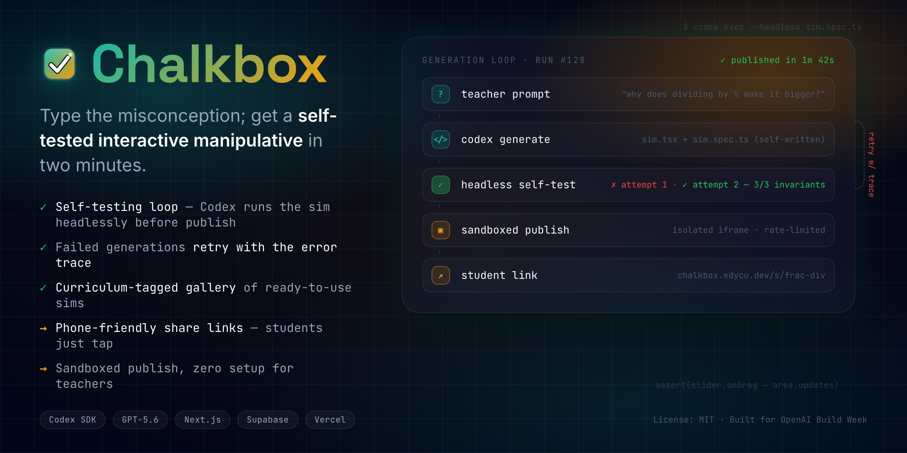
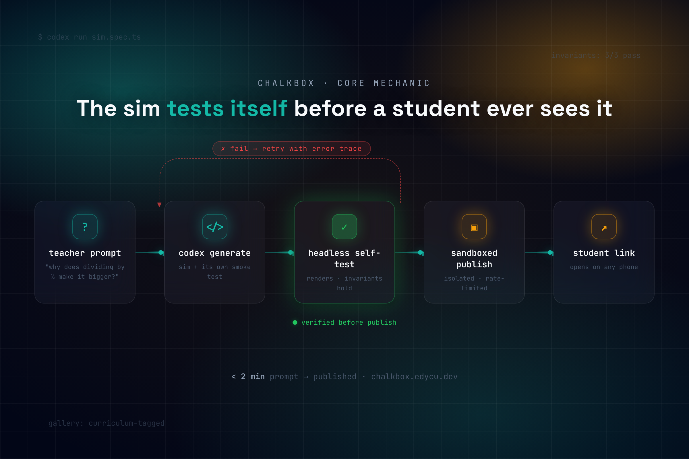

<div align="center">
  <h1>Chalkbox ✏️</h1>
  <p><em>Type the misconception; get a self-tested interactive manipulative in two minutes.</em></p>
  

  <br/><br/>

  [](https://chalkbox.edycu.dev)
  [](#-demo-video)
  [](https://openai.devpost.com)

  <br/>

  
  
  
  
  
  
  [](LICENSE)

</div>

---

## 📸 See it in Action

<div align="center">
  
</div>

> **A teacher types a misconception → Codex writes a manipulative, runs its own smoke test, retries on failure, and only then publishes → a student opens it on any phone.** Nothing untested reaches a child.

---

## 💡 The Problem & Solution

Interactive manipulatives are the single most effective tool for breaking a math or physics misconception — and the one artifact a teacher can never make herself. She can write a worksheet. She can find a video. She cannot author software at 9 PM for tomorrow's 8 AM class. Edtech vendors ship a fixed catalog on a multi-month roadmap, not the bespoke thing *her* class is stuck on tonight.

**Chalkbox** closes that gap. A teacher types the misconception she wants to break — *"show why dividing by a fraction makes the answer bigger, not smaller"* — and in under two minutes she has a live, draggable manipulative her students open on any phone. No code. No app store. No waiting for a vendor.

**Key Features:**
- ⚡ **Self-testing generation loop** — At runtime, Codex writes a single-file interactive React component, renders it headlessly, asserts its *interactive invariants* hold (a smoke test Codex also writes), retries with the error trace on failure, and only then publishes. This loop is the moat.
- 🎓 **Curriculum-tagged gallery** — A public grid seeded with manipulatives, each showing its real Common Core / NGSS standard code and the exact prompt that generated it.
- 📱 **Phone-friendly share links** — Students open a zero-chrome sim running inside a locked-down, network-severed sandboxed iframe.

---

## 🧠 Why the loop matters (the moat)

A single chat completion can produce plausible-looking code. It cannot **execute** it, **test** it, **read the failure**, and **fix** it. Chalkbox does exactly that, every generation:

```
G1  Luna safety + standard gate  →  accept (math, grade 6-8, CCSS.6.NS.A.1)
    codex generate               →  interactive component + invariant spec
G2  static/AST validation        →  import allowlist, no network APIs
    headless render              →  mounts, deterministic, fake timers
G3  interactive invariants       →  "drag divisor smaller ⇒ quotient bigger" ✓
    (fail → retry with trace, bounded budget)
G4  Luna output safety           →  no inappropriate labels
    publish                      →  sandboxed iframe, CSP no-network
```

The pedagogy itself is encoded as a machine-checked test. If Codex generates a sim where dragging the divisor down makes the quotient go *down*, it's pedagogically wrong even though it "renders fine" — and **G3 catches it and forces a retry.** See [`docs/COMPLEXITY.md`](docs/COMPLEXITY.md) for the full invariant DSL and sandbox model.

---

## 🏗️ Architecture & Tech Stack

| Layer | Technology |
|---|---|
| **Frontend** | Next.js + React on Vercel |
| **Generation engine** | Codex SDK (TypeScript) driving `codex` in sandboxed per-request working dirs |
| **Models** | GPT-5.6 **Sol** (generation/iteration) · GPT-5.6 **Luna** (triage: safety gate + grade tag + standard alignment) |
| **Data** | Supabase (share links + gallery) |
| **Sandbox** | Null-origin iframe · strict CSP (`connect-src 'none'`) · import allowlist · AST validation |

Full design in [`docs/ARCHITECTURE.md`](docs/ARCHITECTURE.md) · complexity blueprint in [`docs/COMPLEXITY.md`](docs/COMPLEXITY.md) · demo data in [`docs/SEED_DATA.md`](docs/SEED_DATA.md).

---

## 🤝 Where Codex Accelerated

> Populated from the primary Codex CLI session (the `/feedback` Session ID submitted with this project). This section quotes the real decision points where Codex authored, tested, and iterated the generation pipeline — filled in as the build progresses.

---

## 🚀 Getting Started

> **For Judges:** the live gallery at [chalkbox.edycu.dev](https://chalkbox.edycu.dev) is browsable with zero setup — no login. A rate-limited "generate live" button runs the real pipeline.

### Prerequisites
- Node.js ≥ 20
- npm

### Local run
```bash
git clone https://github.com/edycutjong/chalkbox.git
cd chalkbox
npm install
cp .env.example .env.local   # add your OpenAI + Supabase keys
npm run dev
```

---

## 🎯 Scope & Honest Limitations

- **Math and physics manipulatives only** — stated proudly. That discipline is why the generation loop can be hardened enough to trust with 32 kids.
- **Runtime generation has real latency and a non-zero failure rate** even after retry. We publish the true success rate (from `scripts/bench.ts`) rather than hide it — and the seeded gallery means a judge never *needs* a live generation to succeed to evaluate the product.
- A passing smoke test asserts interactive invariants, not a formal proof of pedagogical soundness.

---

## 🎬 Demo Video

_Link added before submission — a ≤3-min narrated walkthrough with the self-test loop as the centerpiece. Script in [`docs/SUBMISSION.md`](docs/SUBMISSION.md)._

---

## 📄 License

[MIT](LICENSE) © 2026 Edy Cu

## 🙏 Acknowledgments

Built for **OpenAI Build Week 2026** (Education track). Thank you to OpenAI for Codex and the GPT-5.6 models — the coding-agent workflow *is* the product.
