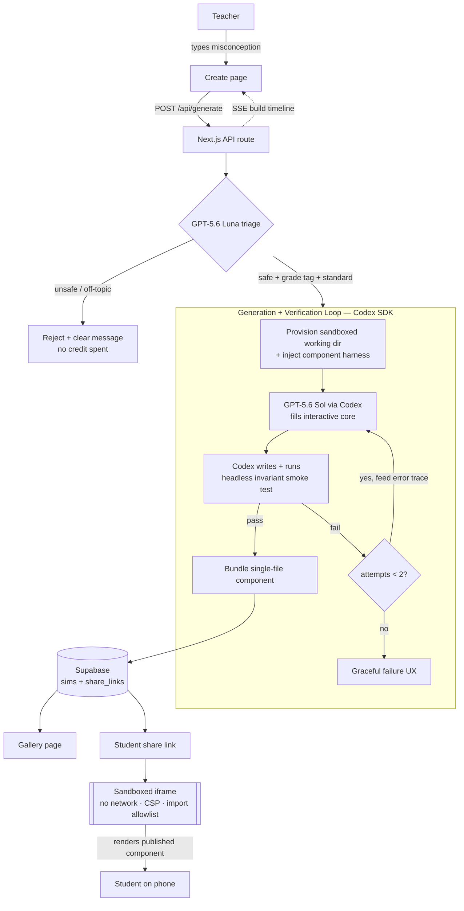

# ARCHITECTURE — Chalkbox

> Optimized for a 5–6 day solo sprint on this builder's exact stack. The entire technical bet is the **generation + verification loop**; the rest is deliberately boring plumbing. No blockchain, no crypto — "proof of production" here = live URL + generation-success benchmark + seeded gallery + real teacher usage.

---

## 1. Tech Stack (chosen for speed + the load-bearing story)

| Layer | Choice | Why |
|---|---|---|
| Frontend / app | **Next.js (App Router) + React**, deployed on **Vercel** at `chalkbox.edycu.dev` | Builder's home stack; SSR gallery + API routes in one repo; instant deploys |
| Persistence | **Supabase** (Postgres + Auth + Storage) | Share links + gallery + magic-link auth with near-zero setup; RLS for ownership |
| Auth | **Supabase magic-link only** | The entire auth story — a teacher owns her creations; no passwords/OAuth/roles |
| Generation engine | **Codex SDK (TypeScript)** driving `codex` in a **sandboxed per-request working dir** | The product. Runtime write-execute-test-retry — the thing a bare completion cannot do |
| Reasoning models | **GPT-5.6 Sol** (generation/iteration), **GPT-5.6 Luna** (triage: grade tag + safety gate + standard alignment) | Sol = flagship quality where correctness matters; Luna = fast/cheap for the high-volume gate that runs on every prompt before spending a Sol credit |
| Generated artifact | **Single-file React component** rendered in a **locked-down sandboxed iframe** | One artifact shape = a hardenable harness; iframe = the safety boundary |
| Verification | **Headless render + invariant smoke test** (Playwright/headless Chromium), test authored by Codex | The moat, made spot-checkable |
| Build tooling | **Codex CLI + IDE extension** (the primary `/feedback` thread) | The build itself runs in Codex → the submitted Session ID genuinely covers core work |

**Boilerplate recommendation:** start from `npx create-next-app@latest` (TypeScript, App Router, Tailwind) + `npx supabase init`. No heavier template — the differentiator is the pipeline, and a starter would only add surface to harden.

## 2. System Architecture (Mermaid)



## 3. The Generation + Verification Loop (the whole product)

This is where all depth lives. Steps, in order, per request:

1. **Triage (Luna).** One cheap GPT-5.6 Luna call classifies the prompt: (a) classroom-safety / appropriateness gate — *decline before any Sol credit is spent*; (b) subject in-scope? (math/physics, else decline with a scope message); (c) infer grade band; (d) align to the nearest Common Core / NGSS standard from `standards.json`. Output is structured JSON.
2. **Provision.** Create an isolated per-request working directory and inject the **component harness** — a fixed shell (`<Manipulative/>` contract: a mount point, a declared list of interactive controls, a `readout` slot, and a `describeInvariants()` export). Codex only fills the interactive core; it never touches the shell, network config, or import list.
3. **Generate (Sol via Codex SDK).** Codex, running `gpt-5.6` (Sol) at high reasoning effort, writes the single-file React manipulative into the harness, plus the accompanying **smoke test** asserting the interactive invariants (see `SEED_DATA.md` §4).
4. **Verify (headless).** Codex runs the smoke test against a headless render (headless Chromium). Assertions: mounts w/o error, every declared control responds to a synthetic event, the core relationship holds at ≥3 sampled points, no `NaN`/`Infinity` in the DOM, and no out-of-allowlist import / network attempt.
5. **Retry-with-trace.** On failure, the exact error trace + failing assertion is fed back to Codex for **one** more attempt (max 2 total). This is the on-camera moment — the agent debugging its own output.
6. **Publish.** On pass, bundle the component and persist to Supabase; mint a share link; optionally list in Gallery. On terminal failure, return the graceful "didn't pass its tests — try rephrasing" state.
7. **Stream.** Throughout, the API route emits **Server-Sent Events** so the Create page shows the honest, timestamped build timeline (triage → writing → testing → retrying → published).

**Time/credit budget:** p50 ≤ 120 s; rate-limited in prod (prepaid credits, no auto top-up); ~20% of credits reserved for demo-week generations.

## 4. Sandbox & Safety Model (defense in depth)

The generated code is untrusted-by-construction. Four independent layers:

1. **Luna content gate** (pre-generation) — inappropriate/off-topic prompts never reach Sol.
2. **Component harness** — Codex fills a constrained core inside a fixed shell; it cannot rewrite the network/import policy.
3. **Static import allowlist** — the bundler rejects any import outside a small allowlist (React + a math/drawing helper set); build fails → publish blocked.
4. **Sandboxed iframe at runtime** — every published sim renders in an `<iframe sandbox>` with **no network** (CSP `connect-src 'none'`, `default-src 'none'` except inline needed for the component), no top-navigation, no same-origin access to the parent. A student can only interact with the sim.

**Honest boundary (per PRD §9):** this is layered defense, not a claim of an unbreakable jail. If any escape is found, live generation is disabled and the (already-verified, static) Gallery stays up; disclosed in the README.

## 5. Database Schema (Supabase / Postgres)

```sql
-- Teachers (magic-link auth; Supabase auth.users is the identity source)
create table profiles (
  id          uuid primary key references auth.users(id),
  display_name text,
  created_at  timestamptz default now()
);

-- One generated manipulative
create table sims (
  id            uuid primary key default gen_random_uuid(),
  slug          text unique not null,          -- stable id; seed fixtures upsert on this
  owner_id      uuid references profiles(id),  -- null for seed personas
  title         text not null,
  subject       text not null check (subject in ('math','physics')),
  grade_band    text not null,                 -- e.g. '6', '9-12'
  standard_code text,                          -- e.g. '6.NS.A.1', 'HS-PS2-1'
  standard_text text,                          -- official description (from standards.json)
  prompt        text not null,                 -- the teacher sentence (shown on card)
  component_src text not null,                 -- the single-file React component
  smoke_src     text not null,                 -- Codex-authored smoke test (spot-checkable)
  status        text not null default 'published'
                  check (status in ('generating','published','failed')),
  attempts      int not null default 1,        -- generation attempts used (retry evidence)
  is_seed       boolean not null default false,
  in_gallery    boolean not null default false,
  created_at    timestamptz default now()
);

-- Phone-friendly student share links (short, unguessable)
create table share_links (
  token      text primary key,                 -- short random slug in the URL
  sim_id     uuid not null references sims(id) on delete cascade,
  created_at timestamptz default now()
);

-- Per-request generation telemetry (feeds bench + honest success-rate reporting)
create table generation_events (
  id          uuid primary key default gen_random_uuid(),
  prompt      text,
  subject     text,
  triage_pass boolean,                          -- Luna gate result
  attempts    int,
  passed      boolean,                          -- did it publish?
  ms_total    int,                              -- wall-clock
  created_at  timestamptz default now()
);
```

**RLS:** teachers read/write only their own `sims`; `in_gallery = true` and all `share_links` targets are publicly readable; `generation_events` insert-only from the server.

## 6. API Endpoints (Next.js route handlers)

| Method + path | Purpose | Notes |
|---|---|---|
| `POST /api/generate` | Run the full loop for one prompt | **Streams SSE** build-timeline events; writes `generation_events` |
| `GET /api/sims/:slug` | Fetch one published sim (component + metadata) | Public if `in_gallery` or via a valid share token |
| `GET /api/gallery` | List gallery sims (filter by subject/grade/standard) | SSR-cached |
| `POST /api/share` | Mint a share link for an owned sim | Auth required |
| `GET /s/:token` | Student view — renders sim in sandboxed iframe | Phone-first, zero-chrome, no auth |
| `POST /api/auth/magic-link` | Supabase magic-link sign-in | The entire auth surface |
| `GET /api/health` | Liveness for uptime checks | — |

## 7. Model Selection with Domain Justification

Per workflow Step 4 — name each model, defend it for this domain, say what a generic choice would miss.

- **GPT-5.6 Sol (generation/iteration) — via Codex SDK.** Chosen because the task is *write-and-verify interactive code*, not "describe a manipulative." Only a coding agent driving Sol can author a React component, run its own smoke test, read the failure trace, and fix it. A plain chat completion (or Luna alone) would emit plausible-looking code with no execution feedback loop — exactly the "looks right, silently broken" failure that would put untested software in front of 32 kids. Sol's high reasoning effort is reserved for the one step where correctness is load-bearing.
- **GPT-5.6 Luna (triage) — safety gate + grade tag + standard alignment.** Chosen because triage is a high-volume, low-latency classification that runs on *every* prompt *before* any expensive generation. Using Sol here would burn flagship credits on a gate; using no gate would let inappropriate prompts reach generation and let off-topic prompts waste credits. Luna does the cheap, fast, correct thing: decline-or-route in one call.
- **Why the tier split matters (removal test):** delete Codex/Sol and there is no code, no test, no retry, no product — a chatbot answer is not a running program. Delete Luna and every prompt either costs flagship money or loses its safety gate. The split is load-bearing, not decorative.

*(The "named vector / feature depth audit" in the workflow applies to vector-DB hackathons only — N/A here.)*

## 8. Codex / GPT-5.6 Surface Depth (≥3 load-bearing surfaces)

1. **Codex SDK (TypeScript) at runtime** — drives `codex` in a sandboxed working dir per request; writes-executes-tests-retries. *This is the product.*
2. **GPT-5.6 Sol + Luna tier split** — generation vs. triage/safety, each purpose-selected.
3. **Codex CLI + IDE extension as build tooling** — the primary `/feedback` thread builds the pipeline, so the submitted Session ID covers the majority of core functionality by construction.

Optional depth to cite in the README (from RESEARCH.md dev-doc corpus): Responses API **prompt caching** for the reused harness/context pack; the `openai/skills` `openai-docs` skill to keep the project on the GPT-5.6 family. These are garnish, not gates.

## 9. Proof-of-Production Artifacts (no blockchain — see PRODUCTION_PLAN.md)

- **Live URL:** `chalkbox.edycu.dev` (Vercel), seeded Gallery + rate-limited live generation, zero-setup judge-testable.
- **`scripts/bench.ts`** — runs the fixed 20-prompt suite, outputs p50/p95 wall-clock + generation success rate + verification catch rate. The reproducible benchmark the rubric rewards.
- **`scripts/seed.ts --apply`** — deterministic Gallery reproduction (see `SEED_DATA.md` §5).
- **`scripts/check_submission_readiness.ts`** — fails if any submission field is a placeholder.
- **Test count** — target 100+ (loop unit tests + harness/invariant tests + the 15 committed smoke tests), stated in the README.
- **Real teacher usage** — ≥5 external teachers' sims in the Gallery by Jul 19–20 (the traction decider).
