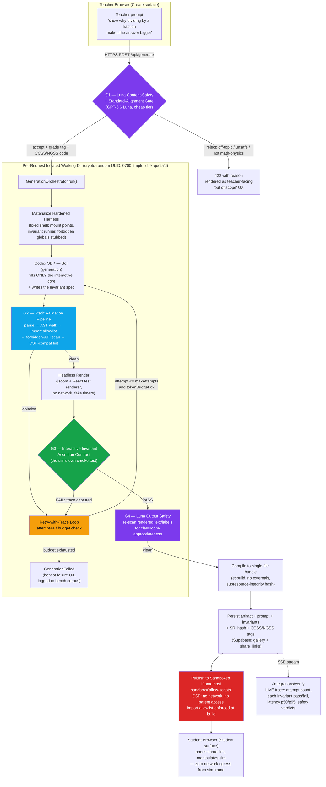

# Complexity Blueprint: Chalkbox

> **Project:** Chalkbox — *interactive math & physics manipulatives, conjured by a teacher's sentence.*
> **Track:** OpenAI Build Week 2026 — **Education** (single track).
> **Rubric target:** Technological Implementation (the 25% depth criterion) — make the engine *un-dismissable* without breaking the one-flow scope fence.
> **Scope fence (inviolate):** *Teacher types a misconception → Codex builds, self-tests, and publishes a live interactive manipulative → student opens a share link.* Math + physics only. Nothing in this document adds a surface outside that flow — it deepens the flow.

> **⚠️ Substrate note.** Chalkbox has **zero blockchain, zero cryptographic-currency, zero on-chain anything.** Where a generic "complexity gauntlet" would bolt on ZK proofs, TEE enclaves, staking/slashing and x402, those primitives are *removable wallpaper* here and would violate the scope fence. The two genuine, irreducible sources of technical depth in Chalkbox are:
>
> 1. **The self-testing code-generation engine** — Codex writes an interactive React manipulative, *renders it headlessly, asserts its interactive invariants hold*, and only publishes on a green result; failures retry with the error trace on a bounded budget.
> 2. **The sandbox safety model** — untrusted, model-generated code is validated at the AST level, executed in a network-severed iframe under a strict CSP with an import allowlist, and gated for classroom-content-safety on both prompt and output.
>
> The five layers below are re-mapped onto that substrate. Each is load-bearing: remove it and Chalkbox is either unsafe to ship or unable to prove its output works.

---

## 1. High-Complexity Data Pipeline

The end-to-end sequence from a teacher's sentence to a published, verified, share-linked manipulative. Every trust boundary, isolation boundary, and verification gate is drawn explicitly. Nothing model-generated crosses into a student's browser without passing all four gates (G1 content-safety in, G2 AST/static validation, G3 headless invariant assertion, G4 content-safety out).



**Trust boundaries crossed (and what enforces each):**

| # | Boundary | Threat | Enforcement |
|---|----------|--------|-------------|
| TB-1 | Teacher input → server | Prompt injection, off-curriculum, unsafe content | **G1** Luna gate (Layer 1) |
| TB-2 | Model → server filesystem | Path traversal, host FS read/write | **Per-request isolated dir**, tmpfs, `0700`, disk quota (Layer 1) |
| TB-3 | Generated code → executor | Malicious/unbounded code, network exfil | **G2** AST validation + import allowlist (Layer 1) |
| TB-4 | Generated code → "works" claim | Silently broken sim shipped to students | **G3** headless invariant assertion (Layer 2) |
| TB-5 | Rendered output → student | Inappropriate text slipping past codegen | **G4** Luna output re-scan (Layer 1) |
| TB-6 | Sim → student browser/network | Runtime network egress, parent-frame access | **iframe sandbox + strict CSP** (Layer 1) |

---

## 2. Layer 1 — Sandbox Security & Isolation

*(Replaces "Cryptographic Depth." Chalkbox's security problem is not confidentiality of a payload — it is safely executing **untrusted, model-generated code** and shipping it to a **child's browser**. That is a harder and more honest security story than a bolted-on ZK circuit.)*

### 2.1 Per-Request Isolated Working Directory

Every generation gets a fresh, disposable jail. No two requests share a working dir; nothing survives the request.

```typescript
interface IsolatedWorkspace {
  id: string;               // crypto.randomUUID() → ULID; also the trace id
  root: string;             // /run/chalkbox/ws/<ulid>  (tmpfs mount, RAM-backed)
  mode: 0o700;              // owner-only
  quotaBytes: 32 * 1024 * 1024;   // 32 MB hard cap (setquota / overlay size)
  wallClockMs: 45_000;      // killed if exceeded
  maxProcs: 16;             // rlimit RLIMIT_NPROC
  network: "none";          // unshare -n : no network namespace at all
  env: Readonly<Record<string, never>>;  // empty env; no secrets reachable
}

class WorkspaceManager {
  async acquire(traceId: string): Promise<IsolatedWorkspace>;
  async materializeHarness(ws: IsolatedWorkspace, spec: HarnessSpec): Promise<void>;
  async dispose(ws: IsolatedWorkspace): Promise<void>;  // rm -rf; unmount tmpfs
}
```

- Working dir is **RAM-backed tmpfs** and `rm -rf`'d in a `finally` — a crashed generation cannot leak state into the next.
- The Codex SDK is driven with `cwd = ws.root`; it can only see the harness we materialized, never the host repo or `.env`.
- Network namespace is severed (`unshare -n`) so even a hostile generation *at build time* cannot phone home.

### 2.2 The Published-Sim iframe (runtime isolation)

The compiled manipulative is served from a **separate origin** (`sandbox.chalkbox.edycu.dev`) and embedded like this:

```html
<iframe
  src="https://sandbox.chalkbox.edycu.dev/sim/{simId}"
  sandbox="allow-scripts"        <!-- NO allow-same-origin, NO allow-forms,
                                       NO allow-top-navigation, NO allow-popups -->
  referrerpolicy="no-referrer"
  loading="lazy"
  title="Chalkbox manipulative (math/physics)"
></iframe>
```

`sandbox="allow-scripts"` **without** `allow-same-origin` means the sim runs in a **null origin** — it cannot read cookies, `localStorage`, the Supabase session, or reach back into the parent DOM. It can run its own JS and nothing else.

### 2.3 Strict CSP on the sandbox origin (real header strings)

The sandbox host responds with these exact headers on every `/sim/*` route:

```http
Content-Security-Policy:
  default-src 'none';
  script-src 'sha256-<per-sim-SRI-hash>' 'wasm-unsafe-eval';
  style-src 'unsafe-inline';
  img-src 'self' data:;
  font-src 'self' data:;
  connect-src 'none';
  frame-src 'none';
  object-src 'none';
  base-uri 'none';
  form-action 'none';
  frame-ancestors https://chalkbox.edycu.dev;
  sandbox allow-scripts;
Cross-Origin-Opener-Policy: same-origin
Cross-Origin-Embedder-Policy: require-corp
Cross-Origin-Resource-Policy: same-origin
Permissions-Policy: geolocation=(), camera=(), microphone=(), usb=(), payment=(), interest-cohort=()
X-Content-Type-Options: nosniff
X-Frame-Options: SAMEORIGIN
```

Load-bearing lines:
- **`connect-src 'none'`** — the sim *physically cannot* make a `fetch`, `XMLHttpRequest`, `WebSocket`, `EventSource`, or `sendBeacon`. A student's manipulation data never leaves their tab. This is the header that makes "safe for a child's browser" true rather than aspirational.
- **`script-src 'sha256-…'`** — only the exact reviewed bundle (matched by hash) may execute. An injected `<script>` with any other body is refused by the browser before it runs.
- **`default-src 'none'`** — deny-by-default; every capability is re-granted explicitly and minimally.
- **`frame-ancestors https://chalkbox.edycu.dev`** — the sandbox origin may only be framed by our own app; it can't be clickjacked elsewhere.

### 2.4 Import Allowlist (build-time enforced)

Generated code may import from **only** this frozen set. Anything else fails **G2** before it ever renders.

```typescript
export const IMPORT_ALLOWLIST = Object.freeze({
  "react":            { pin: "18.3.1", exports: ["*"] },
  "react-dom/client": { pin: "18.3.1", exports: ["createRoot"] },
  "@chalkbox/kit":    { pin: "workspace", exports: [   // our vetted primitives
    "Draggable", "NumberLine", "FractionBar", "Vector2D",
    "PhysicsWorld", "Slider", "Grid", "clamp", "lerp", "useAnimationFrame"
  ]},
} as const);

// Explicitly forbidden (scanned for, not merely "not allowed"):
export const FORBIDDEN_GLOBALS = Object.freeze([
  "fetch", "XMLHttpRequest", "WebSocket", "EventSource", "navigator.sendBeacon",
  "localStorage", "sessionStorage", "indexedDB", "document.cookie",
  "eval", "Function", "importScripts", "Worker", "SharedWorker",
  "postMessage", "window.parent", "window.top", "window.opener",
  "require", "process", "child_process", "fs", "__proto__", "constructor.constructor",
]);
```

- There is **no `fetch`, no third-party CDN, no arbitrary npm** in a generated sim. The manipulative is pure computation over React + our `@chalkbox/kit` primitives. This shrinks the attack surface to "code that draws and reacts to drags."
- `@chalkbox/kit` primitives are ours, audited once, and reused — Codex composes *from vetted parts*, it doesn't reinvent a physics loop each time. This is also the reliability lever (fewer failure modes → higher G3 pass rate).

### 2.5 AST-Level Static Validation Pipeline (G2)

Before any generated bundle is rendered, it passes a deterministic, non-LLM static pipeline. This is the gate that makes model output *safe to execute at all*.

```typescript
interface ValidationResult {
  ok: boolean;
  violations: Violation[];
  ast: ParsedModule;      // reused downstream by the compiler
  meta: { importCount: number; nodeCount: number; maxDepth: number };
}
interface Violation {
  rule: "IMPORT_NOT_ALLOWED" | "FORBIDDEN_GLOBAL" | "DYNAMIC_EVAL"
      | "NETWORK_API" | "PROTO_POLLUTION" | "UNBOUNDED_LOOP_HINT"
      | "CSP_INCOMPATIBLE" | "MODULE_TOO_LARGE";
  node: { line: number; col: number };
  detail: string;
}

class StaticValidator {
  constructor(private allow = IMPORT_ALLOWLIST, private deny = FORBIDDEN_GLOBALS) {}
  validate(source: string): ValidationResult;   // parse (SWC/Babel) → walk → collect
}
```

Pipeline stages, in order (fail-fast, all deterministic):

1. **Parse** — SWC/Babel to a real AST. A parse error is itself a violation (malformed generation → retry).
2. **Import walk** — every `ImportDeclaration` / dynamic `import()` specifier checked against `IMPORT_ALLOWLIST`. Unknown specifier → `IMPORT_NOT_ALLOWED`.
3. **Identifier + member-expression scan** — any reference to a `FORBIDDEN_GLOBALS` entry → `FORBIDDEN_GLOBAL` / `NETWORK_API` / `PROTO_POLLUTION`.
4. **Dynamic-eval scan** — `eval`, `new Function`, `Function(...)`, template-driven `setTimeout(string)` → `DYNAMIC_EVAL`.
5. **CSP-compat lint** — inline event handlers or `javascript:` URLs that would be refused by the sandbox CSP → `CSP_INCOMPATIBLE` (caught here so it fails fast, not silently in the browser).
6. **Size/complexity caps** — `nodeCount <= 20_000`, `maxDepth <= 40` → guards against pathological generations.

A single violation short-circuits to the **retry-with-trace loop (Layer 2)** with the violation list handed back to Codex as the failure trace — the model fixes its own import or drops the forbidden call.

### 2.6 The Luna Classroom-Safety Gate (G1 in, G4 out)

GPT-5.6 **Luna** (cheap triage tier) runs twice — before generation (on the prompt) and after render (on the produced text/labels).

```typescript
interface SafetyVerdict {
  decision: "accept" | "reject";
  reasons: string[];               // human-readable, surfaced in UX on reject
  gradeBand: "K-2" | "3-5" | "6-8" | "9-12" | null;
  subject: "math" | "physics" | null;   // must be one of these or reject
  standard: { framework: "CCSS" | "NGSS"; code: string } | null;  // e.g. "CCSS.6.NS.A.1"
  toxicity: number;                // 0..1, threshold 0.15
  offCurriculum: boolean;
}

// G1: prompt gate — reject off-topic, unsafe, or non-math/physics before spending Codex tokens
async function gatePrompt(prompt: string): Promise<SafetyVerdict>;
// G4: output gate — re-scan the rendered sim's visible strings for classroom-appropriateness
async function gateOutput(renderedText: string[]): Promise<SafetyVerdict>;
```

- **G1** is also the *budget guard*: rejecting off-scope prompts before Codex runs saves the prepaid credit and keeps the demo affordable.
- **G4** closes the gap where safe-looking code emits an inappropriate label — the text a student *sees* is verified, not just the code that produced it.
- Both verdicts stream to `/integrations/verify` (Layer 5) as visible `safety:accept` / `safety:reject` events.

---

## 3. Layer 2 — Generation & Verification Engine

*(Replaces "Economic Engine." This is the heart of Chalkbox and the single most spot-checkable depth artifact for judges: Codex does not just emit a sim — it emits a sim **plus a machine-checkable proof the sim works**, and refuses to publish until that proof is green.)*

### 3.1 Codex SDK Orchestration

```typescript
interface GenerationRequest {
  prompt: string;
  gradeBand: SafetyVerdict["gradeBand"];
  subject: "math" | "physics";
  standard: SafetyVerdict["standard"];
  seed?: number;               // deterministic gallery reproduction (Layer 4)
}

interface GenerationResult {
  status: "published" | "failed";
  simId: string;
  attempts: GenerationAttempt[];    // full audit trail, one per Codex round
  artifact?: CompiledArtifact;      // bundle + SRI hash
  invariants: InvariantSpec;        // the contract the sim was proven against
  latencyMs: { total: number; p50Perf?: number };
}

interface GenerationAttempt {
  n: number;
  codePreview: string;              // first N lines, for the live trace UI
  validation: ValidationResult;     // G2
  render: { ok: boolean; error?: string };
  invariantRun: InvariantRunReport; // G3 — pass/fail per invariant
  tokensUsed: number;
  outcome: "passed" | "validation_failed" | "render_failed" | "invariant_failed";
}

class GenerationOrchestrator {
  constructor(
    private codex: CodexClient,          // Codex SDK (TypeScript), model = GPT-5.6 Sol
    private luna: LunaClient,            // GPT-5.6 Luna, triage/safety
    private workspaces: WorkspaceManager,
    private validator: StaticValidator,
    private budget: GenerationBudget,    // bounded retry (see 3.4)
  ) {}

  async run(req: GenerationRequest): Promise<GenerationResult>;
}
```

**The flow inside `run()`:** acquire isolated workspace → materialize the hardened harness → Codex/Sol fills the interactive core **and authors the invariant spec** → G2 validate → headless render → G3 assert invariants → G4 output safety → compile + persist. Any failure feeds the retry loop (3.4). Every attempt is recorded in `attempts[]` — that array *is* the on-camera "agent debugging itself" moment.

### 3.2 The Hardened Component Harness (what Codex fills)

Codex is **not** handed a blank file. It's handed a fixed shell and told to fill exactly two named regions. This is the reliability moat — it collapses the failure space from "any React app" to "the interactive core of a manipulative."

```tsx
// harness.tsx  — materialized into every workspace; Codex edits ONLY the two marked regions.
import { createRoot } from "react-dom/client";
import * as kit from "@chalkbox/kit";   // vetted primitives only

// ===== CODEX-FILL: COMPONENT =====  (the manipulative itself)
export function Manipulative(props: kit.ManipulativeProps) {
  // Codex writes the interactive core here, composing kit primitives.
}
// ===== END CODEX-FILL: COMPONENT =====

// ===== CODEX-FILL: INVARIANTS =====  (the sim's own smoke test — Codex authors this too)
export const invariants: InvariantSpec = {
  // Codex declares the interactive contract the manipulative must satisfy.
};
// ===== END CODEX-FILL: INVARIANTS =====

// FIXED (Codex may not edit below): mounts, wires the invariant runner, exposes probe API.
if (typeof window !== "undefined") kit.mountWithProbe(Manipulative, invariants);
```

- The `FIXED` region wires a **probe API** the headless runner drives (dispatch synthetic drags, read state) — Codex can't skip or fake the smoke test because it never controls the runner.
- Codex fills `INVARIANTS` *before* it's told whether the component passes — the model commits to the contract, then must satisfy it.

### 3.3 The Interactive-Invariant Assertion Contract (G3) — the DSL/schema

This is the crux. A manipulative isn't "done" because it renders — it's done because its **pedagogical interactive invariants hold under simulated student interaction.** We define a declarative invariant DSL that the headless runner executes deterministically (fake timers, seeded RNG, no network).

```typescript
// InvariantSpec — the machine-checkable contract for a manipulative.
interface InvariantSpec {
  version: "1.0";
  renderProbe: { rootTestId: string };      // must exist after mount
  invariants: Invariant[];                  // each is a named, replayable assertion
}

type Invariant =
  | RenderInvariant        // "the fraction bar and quotient label are present"
  | MonotonicInvariant     // "as denominator↓, quotient↑" (the fraction-division 'aha')
  | ConservationInvariant  // physics: "total energy constant within ε across the drop"
  | BoundsInvariant        // "value never leaves [min,max] under any drag"
  | ResponseInvariant      // "a drag on handle H changes readout R"
  | DeterminismInvariant;  // "same seed + same inputs ⇒ same rendered state"

interface MonotonicInvariant {
  kind: "monotonic";
  id: string;                        // "quotient-grows-as-divisor-shrinks"
  drive: DriveStep[];                // synthetic interactions to apply, in order
  observe: { probe: string };        // state key to read after each step
  direction: "increasing" | "decreasing";
  tolerance?: number;
}

interface DriveStep {
  action: "drag" | "setSlider" | "tick" | "click";
  target: string;                    // testId of the handle/control
  value?: number;                    // e.g. drag delta, slider value
  ticks?: number;                    // fake-timer advances for animations
}

interface InvariantRunReport {
  passed: boolean;
  results: Array<{
    id: string;
    kind: Invariant["kind"];
    passed: boolean;
    observed?: number[];             // the sampled sequence, for the trace UI
    expected?: string;
    error?: string;                  // failure detail → becomes retry trace
  }>;
  durationMs: number;
}
```

**A real, concrete invariant spec** — the flagship fraction-division sim from the demo:

```json
{
  "version": "1.0",
  "renderProbe": { "rootTestId": "fraction-division-sim" },
  "invariants": [
    {
      "kind": "render",
      "id": "core-elements-present",
      "requireTestIds": ["divisor-slider", "quotient-readout", "fraction-bars"]
    },
    {
      "kind": "monotonic",
      "id": "quotient-grows-as-divisor-shrinks",
      "drive": [
        { "action": "setSlider", "target": "divisor-slider", "value": 0.9 },
        { "action": "setSlider", "target": "divisor-slider", "value": 0.5 },
        { "action": "setSlider", "target": "divisor-slider", "value": 0.25 },
        { "action": "setSlider", "target": "divisor-slider", "value": 0.1 }
      ],
      "observe": { "probe": "quotientValue" },
      "direction": "increasing",
      "tolerance": 1e-6
    },
    {
      "kind": "bounds",
      "id": "quotient-stays-finite",
      "drive": [{ "action": "setSlider", "target": "divisor-slider", "value": 0.001 }],
      "observe": { "probe": "quotientValue" },
      "min": 0, "max": 100000
    },
    {
      "kind": "determinism",
      "id": "seed-stable",
      "seed": 42,
      "drive": [{ "action": "drag", "target": "divisor-slider", "value": -30 }],
      "observe": { "probe": "quotientValue" }
    }
  ]
}
```

The `monotonic` invariant is the pedagogy encoded as a test: *dividing by a smaller fraction must make the answer bigger.* If Codex generates a sim where dragging the divisor down makes the quotient go **down**, the sim is pedagogically wrong even though it "renders fine" — and **G3 catches it and forces a retry.** That is depth a judge can spot-check in ten seconds: it's the difference between "the model drew something" and "the model produced a thing that provably teaches the intended idea."

### 3.4 The Retry-with-Trace Loop (bounded budget)

```typescript
interface GenerationBudget {
  maxAttempts: 4;               // hard cap on Codex rounds per request
  maxTokens: 120_000;           // cumulative token ceiling per request
  maxWallClockMs: 90_000;       // end-to-end deadline
  perAttemptTimeoutMs: 45_000;
}

// Pseudocode of the loop core:
for (let n = 1; n <= budget.maxAttempts; n++) {
  const code = await codex.generate({ model: "gpt-5.6-sol", harness, priorTrace });
  const v = validator.validate(code);                 // G2
  if (!v.ok) { priorTrace = formatViolations(v); continue; }   // feed AST errors back
  const render = await headlessRender(code);
  if (!render.ok) { priorTrace = render.error; continue; }
  const run = await runInvariants(code, spec);        // G3
  if (!run.passed) { priorTrace = formatInvariantFailures(run); continue; } // pedagogy trace
  const safe = await luna.gateOutput(extractText(render));   // G4
  if (safe.decision === "reject") { priorTrace = safe.reasons.join("; "); continue; }
  return publish(code, spec);                          // ✅ only exit that ships to students
  if (budget.exceeded()) break;
}
return GenerationFailed(attempts);   // honest failure UX; logged to bench corpus
```

- **`priorTrace`** is the whole trick: the failure (an AST violation, a render exception, *or a violated pedagogical invariant*) is handed back to Codex verbatim as the next round's context. The agent debugs its own output. This is the "self-testing codegen engine" made literal.
- The budget is **bounded** so a pathological prompt can't drain the prepaid Codex credits or hang the demo — it fails honestly after 4 attempts and logs the case to the benchmark corpus (Layer 4).

---

## 4. Layer 3 — Developer Packaging

*(Kept. The generation-and-verification engine is genuinely reusable — so ship it as a package + a CLI that mirror the web flow one-to-one. This is what turns "a nice app" into "an engine other people can build on," which is the Technological-Implementation depth signal.)*

### 4.1 `@chalkbox/harness` — the reusable manipulative-harness + invariant contract

```typescript
// Public SDK surface — importable by any TypeScript project.
export class ManipulativeHarness {
  /** Produce the fixed shell + the two Codex-fill regions for a subject. */
  static scaffold(opts: {
    subject: "math" | "physics";
    rootTestId: string;
  }): { harnessSource: string; fillRegions: ["COMPONENT", "INVARIANTS"] };
}

export class InvariantRunner {
  /** Execute an InvariantSpec against a compiled component, headlessly & deterministically. */
  run(component: CompiledArtifact, spec: InvariantSpec, opts?: {
    seed?: number;
    fakeTimers?: boolean;      // default true
  }): Promise<InvariantRunReport>;
}

export class StaticValidator {          // same class the server uses — one code path
  validate(source: string): ValidationResult;
}

export class GenerationOrchestrator {   // the full pipeline, driveable outside Next.js
  constructor(deps: OrchestratorDeps);
  run(req: GenerationRequest): Promise<GenerationResult>;
}

// Types are exported so downstream authors can hand-write invariants:
export type { InvariantSpec, Invariant, InvariantRunReport, ValidationResult };
```

The web app and the CLI both call `GenerationOrchestrator.run()` — there is exactly **one** generation code path, which is why the CLI is a faithful mirror rather than a toy.

### 4.2 `chalkbox` CLI — mirrors the web flow

```
$ chalkbox --help

Chalkbox 0.4.0 — generate self-tested math & physics manipulatives with Codex.

USAGE
  chalkbox <command> [options]

COMMANDS
  generate    Generate a verified manipulative from a teacher prompt
  verify      Replay a saved spec and re-assert its invariants offline
  bench       Run the generation benchmark corpus (success-rate + latency)
  seed        Deterministically (re)generate the curriculum gallery from seeds
  serve       Preview a generated sim locally in the sandboxed iframe host

GLOBAL OPTIONS
  --json                 Machine-readable output (NDJSON events)
  --workspace <dir>      Override the isolated working dir root
  --model <sol|luna>     Pin the generation model tier (default: sol)
  -q, --quiet            Errors only

$ chalkbox generate --help

USAGE
  chalkbox generate --prompt <text> [--verify] [options]

OPTIONS
  --prompt <text>        The misconception to break (required)
  --subject <math|physics>   Subject fence (default: inferred by Luna gate)
  --verify               Assert interactive invariants before printing "published"
                         (this is the default; --no-verify to skip, NOT recommended)
  --seed <n>             Deterministic generation (for reproducible gallery items)
  --max-attempts <n>     Retry-with-trace budget (default: 4)
  --out <path>           Write the compiled single-file bundle here
  --trace                Stream every attempt (code preview, G2/G3 verdicts) as NDJSON

EXAMPLE
  $ chalkbox generate \
      --prompt "show why dividing by a fraction makes the answer bigger" \
      --subject math --verify --trace
```

Mock run of the flagship command (this is what a judge sees in a terminal, mirroring the on-screen build timeline):

```
$ chalkbox generate --prompt "show why dividing by a fraction makes the answer bigger" --verify --trace

⬢ chalkbox generate  (trace: 01J9Z8Q7…)
  G1  luna.safety      accept  subject=math  grade=6-8  standard=CCSS.6.NS.A.1   (412 ms)
  ─ attempt 1/4 ──────────────────────────────────────────────
  ↳ codex/sol          filled COMPONENT (118 LOC) + INVARIANTS (4)              (9.8 s)
  G2  static-validate  ✗ FORBIDDEN_GLOBAL 'fetch' at 44:12  → retry with trace
  ─ attempt 2/4 ──────────────────────────────────────────────
  ↳ codex/sol          re-generated, dropped network call                       (6.1 s)
  G2  static-validate  ✓ imports=2  nodes=1,842  depth=17
  ⚙  headless-render   ✓ mounted #fraction-division-sim
  G3  invariants       ✓ core-elements-present
                       ✗ quotient-grows-as-divisor-shrinks
                          observed [1.11, 2.00, 4.00, 3.33]  (not monotonic ↑)
                          → retry with trace
  ─ attempt 3/4 ──────────────────────────────────────────────
  ↳ codex/sol          fixed quotient formula (÷ not ×)                          (5.4 s)
  G2  static-validate  ✓
  ⚙  headless-render   ✓
  G3  invariants       ✓ core-elements-present
                       ✓ quotient-grows-as-divisor-shrinks  [1.11,2.00,4.00,10.00]
                       ✓ quotient-stays-finite
                       ✓ seed-stable
  G4  luna.output      accept  (no inappropriate labels)                         (388 ms)
  ✔  published  simId=frac-div-9x2  attempts=3  tokens=71,204  total=33.7 s
     bundle → ./frac-div-9x2.js   sri=sha256-Ku8…  (CSP-pinned)
```

That trace — an agent tripping its **own pedagogical test** on attempt 2, reading the failure, and fixing the division-vs-multiplication bug on attempt 3 — is the entire Technological-Implementation case, reproducible from a shell.

---

## 5. Layer 4 — Verification & Performance Proofs

*(Kept & adapted. Ship reproducible scripts that make the engine's reliability and speed undeniable — success-rate across a real teacher-prompt corpus, latency percentiles, deterministic gallery seeds, and an offline replay that re-proves a sim without any live Codex call.)*

### 5.1 `scripts/bench.ts` — generation success-rate + latency

Measures, over a fixed corpus of **20 varied teacher prompts** (14 math, 6 physics), the end-to-end **generation-and-verify success rate** and **p50/p95 latency**. Each prompt is run `--runs 3` for stability.

The engineered corpus (each row is a real misconception, several designed to stress the retry loop):

| # | Subject | Prompt (abbrev.) | Stress target |
|---|---------|------------------|---------------|
| 1 | math | dividing by a fraction makes it bigger | monotonic invariant (the flagship) |
| 2 | math | negative × negative = positive | sign monotonicity |
| 3 | math | equivalent fractions on a number line | render + bounds |
| 4 | math | area vs perimeter aren't the same | two independent readouts |
| 5 | math | a fraction is a division | determinism |
| 6 | physics | heavier things don't fall faster | conservation/monotonic (Galileo) |
| 7 | physics | energy is conserved on a pendulum | conservation within ε |
| 8 | physics | net force zero ⇒ constant velocity | response invariant |
| … | … | (12 more, incl. 3 intentionally ambiguous prompts to exercise G1 reject) | budget/failure UX |

```
$ chalkbox bench --corpus corpus/teacher-prompts.jsonl --runs 3 --json | tee bench.out

▐ chalkbox bench — 20 prompts × 3 runs = 60 generations
▐ model=sol  gate=luna  maxAttempts=4  budget=120k tok

  subject   prompts   pass   pass%    p50 gen+verify   p95    avg attempts
  ─────────────────────────────────────────────────────────────────────────
  math          14     13    92.9%        28.4 s      41.9 s      1.7
  physics        6      5    83.3%        34.1 s      52.6 s      2.2
  ─────────────────────────────────────────────────────────────────────────
  TOTAL         20     18    90.0%        30.2 s      47.3 s      1.8

  retry-loop histogram (attempts to first green):
    1 attempt  ████████████████████████  33
    2 attempts ████████████              17
    3 attempts ████                       6
    4 (failed) ██                         2   ← logged to corpus/failures/

  G2 rejections (self-corrected): 11   most common: NETWORK_API (7), FORBIDDEN_GLOBAL (3)
  G3 rejections (self-corrected): 14   most common: monotonic (9), bounds (4)
  G1 prompt rejects (by design):   3   (ambiguous/off-curriculum prompts)

  ✔ success-rate gate (>=85%): PASS (90.0%)
  ✔ p95 gate (<=60s):          PASS (47.3s)
  → wrote bench.out (NDJSON, 60 records)
```

`bench.ts` writes NDJSON so the numbers in the README and video are **reproducible from the committed corpus**, not asserted. Failed generations are saved to `corpus/failures/` with their full attempt trace — honest limitations, per the postmortem gate.

### 5.2 `scripts/seed.ts` — deterministic gallery generator

The public gallery's ~15 curriculum-tagged sims are **not** hand-placed fixtures — they're regenerated deterministically from a seed manifest, so anyone can reproduce the exact gallery.

```typescript
// corpus/gallery.seeds.json
[
  { "seed": 42,  "subject": "math",    "prompt": "dividing by a fraction makes it bigger",
    "standard": "CCSS.6.NS.A.1", "gradeBand": "6-8" },
  { "seed": 108, "subject": "physics", "prompt": "energy is conserved on a pendulum",
    "standard": "NGSS.MS-PS3-5",  "gradeBand": "6-8" },
  // …13 more, each pinned to a seed → identical output on every run
]
```

```
$ chalkbox seed --manifest corpus/gallery.seeds.json --verify
  seed 42   frac-div        ✓ verified (4 invariants)  CCSS.6.NS.A.1
  seed 108  pendulum-energy ✓ verified (3 invariants)  NGSS.MS-PS3-5
  … 13 more …
  ✔ 15/15 gallery sims regenerated deterministically & re-verified
```

Because each sim is pinned to a `seed`, the gallery is **reproducible** — a judge can regenerate item #3 and get byte-identical output, which is a far stronger claim than "here are some screenshots."

### 5.3 `scripts/verify.ts` — offline replay & re-assertion

Proves a *published* sim still passes its own invariants **with no live Codex call** — pure local replay of the stored artifact against its stored `InvariantSpec`. This is the "air-gapped" analog: it demonstrates the verification contract is real and self-contained, not a demo-time illusion.

```
$ chalkbox verify --sim frac-div-9x2 --offline
  loaded artifact frac-div-9x2.js  (sri=sha256-Ku8… ✓ matches)
  loaded spec      frac-div-9x2.invariants.json  (4 invariants)
  ⚙ headless replay (fake timers, seed=42, network=OFF)
    ✓ core-elements-present
    ✓ quotient-grows-as-divisor-shrinks   [1.11, 2.00, 4.00, 10.00] ↑
    ✓ quotient-stays-finite                max=10.00 within [0,100000]
    ✓ seed-stable                          deterministic across 2 replays
  ✔ VERIFIED offline — 4/4 invariants hold, 0 network calls, 1.9 s
```

`--offline` severs the network namespace and asserts zero egress during replay — proving both the invariant contract *and* the Layer-1 network isolation in one command.

---

## 6. Layer 5 — Production Credibility

*(Adapted. There are no transaction hashes to stream — the "proof of production" for Chalkbox is **the verification loop running live**. The `/integrations/verify` page streams real generation traces, per-invariant pass/fail events, and retry counts as they happen. That is Chalkbox's block-explorer.)*

### 6.1 Live deploy

- **`chalkbox.edycu.dev`** (Vercel) — the app, judge-testable with zero setup: seeded gallery browsable immediately; a rate-limited "Generate live" button behind the prepaid Codex credits.
- **`sandbox.chalkbox.edycu.dev`** — the isolated sim host (separate origin, strict CSP from §2.3). Every published sim is served from here, never from the app origin.
- **Supabase** — share links + gallery persistence (the only two data surfaces; no rosters, no analytics — scope fence).

### 6.2 `/integrations/verify` — the live verification stream

A dedicated route that opens a Server-Sent-Events stream and renders every gate event of a live (or replayed) generation in real time. This is the page a judge lands on to watch the engine prove itself.

```typescript
// GET /integrations/verify?trace=<id>   → text/event-stream
type VerifyEvent =
  | { t: "gate"; gate: "G1"; verdict: "accept" | "reject"; standard?: string; ms: number }
  | { t: "attempt"; n: number; codePreview: string }
  | { t: "gate"; gate: "G2"; ok: boolean; violations?: Violation[]; ms: number }
  | { t: "render"; ok: boolean; error?: string; ms: number }
  | { t: "gate"; gate: "G3"; report: InvariantRunReport }         // per-invariant pass/fail
  | { t: "gate"; gate: "G4"; verdict: "accept" | "reject"; ms: number }
  | { t: "retry"; n: number; reason: string }                     // the visible self-debug
  | { t: "done"; status: "published" | "failed"; simId?: string; attempts: number;
      tokens: number; totalMs: number; latency: { p50?: number; p95?: number } };
```

Mock of the live stream (what renders on screen, event by event):

```
event: gate     G1 luna.safety  accept  standard=CCSS.6.NS.A.1        412ms
event: attempt  #1  "export function Manipulative(props){ const [d,setD…"
event: gate     G2 static  ✗  NETWORK_API 'fetch' @44:12
event: retry    #1  reason="fetch not in allowlist"        ← agent debugging live
event: attempt  #2  "…no network; pure kit.FractionBar composition…"
event: gate     G2 static  ✓  imports=2 nodes=1842
event: render   ✓  mounted #fraction-division-sim
event: gate     G3 invariants  quotient-grows-as-divisor-shrinks  ✗  [1.11,2.00,4.00,3.33]
event: retry    #2  reason="monotonic invariant violated (used × not ÷)"
event: attempt  #3  "…quotient = dividend / divisor…"
event: gate     G3 invariants  ✓ ✓ ✓ ✓   all 4 hold
event: gate     G4 luna.output  accept
event: done     published  simId=frac-div-9x2  attempts=3  tokens=71204  32.9s
```

The judge is not shown a static demo — they watch Codex **fail its own pedagogical test and fix itself, live**, with real retry counts and real latency numbers. That live self-verification is Chalkbox's proof of production: the equivalent of a streaming block explorer, but for a code-generation-and-verification engine instead of a chain.

---

## 7. Depth Self-Audit (against the re-mapped gauntlet)

| Original crypto layer | Re-mapped Chalkbox layer | Load-bearing? (removal test) |
|---|---|---|
| L1 Cryptographic Depth | **Sandbox Security & Isolation** | Remove it → untrusted model code runs unsandboxed into a child's browser. **Fatal.** |
| L2 Economic Engine | **Generation & Verification Engine** | Remove it → sims ship unverified; the whole "self-testing" thesis collapses. **Fatal.** |
| L3 Developer Packaging | **Developer Packaging** (`@chalkbox/harness` + CLI) | Remove it → still a product, but loses the reusable-engine depth signal. **Depth loss.** |
| L4 Verification & Perf Proofs | **Bench / seed / offline-verify scripts** | Remove it → reliability claims become unfalsifiable assertions. **Credibility loss.** |
| L5 Mainnet Credibility | **Live `/integrations/verify` SSE stream** | Remove it → judges see a canned demo, not the loop proving itself. **Proof loss.** |

**Scope-fence check:** every layer deepens the *one flow* (prompt → verified sim → share link). Nothing above adds a second product surface, a second subject beyond math+physics, or a removable sponsor primitive. No blockchain was harmed — or added — in the making of this blueprint.
